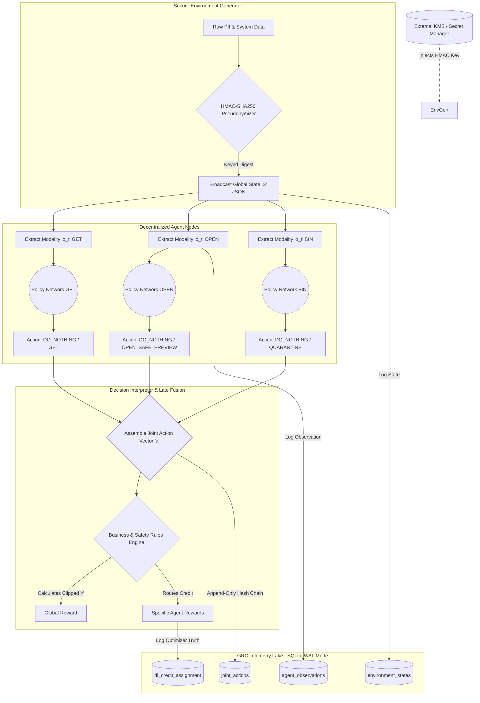

# Enterprise MARL System with GRC Telemetry

This repository contains a Multi-Agent Reinforcement Learning (MARL) system designed to transform a standard demo into a secure, tamper-evident, and reproducible platform. It embeds Governance, Risk, and Compliance (GRC) directly into the environment and training loops.

## 📖 Overview

The architecture simulates a decentralized agent environment (e.g., evaluating mailbox actions) utilising a PyTorch neural network stack and a privacy-first SQLite telemetry data lake. It completely decouples the complex Reinforcement Learning mathematics from data storage to ensure a clean, compliant telemetry lake ready for auditing and analysis.

### Core GRC Capabilities
* **Cryptographic Identity:** Upgrades weak, reversible SHA-256 hashing to KMS-backed HMAC with key rotation and versioning to prevent dictionary attacks.
* **Enforced Data Lifecycle:** Transitions from passive retention logging to active, automated purge mechanisms with cryptographic tombstoning (deletion evidence).
* **Tamper-Evident Ledger:** Implements a hash-chained event pattern and append-only architecture in SQLite to ensure post-incident audit integrity.
* **Deterministic Reproducibility:** Eliminates notebook execution order fragility by refactoring into a seeded, version-pinned Python module.
* **ML Safety & Stabilisation:** Mitigates policy variance and reward hacking via reward clipping, baselines, and gating model updates behind offline evaluation.
* **Safe-by-Design Actions:** Replaces the inherently dangerous "OPEN" action with privileged, sandboxed semantics (`OPEN_SAFE_PREVIEW`, `QUARANTINE`).
* **Complete Telemetry Lineage:** Closes the audit gap by actively writing what agents actually "saw" to the `agent_observations` table with schema versioning.
* **Data Minimisation:** Classifies and segregates operational, security, and behavioral telemetry, moving towards aggregate-first storage.
* **Defense Against Poisoning:** Treats all environment state broadcasts as untrusted, incorporating anomaly detection to prevent adversarial training.
* **Truthful Audit Logging:** Ensures `policy_updated` flags only trigger when mathematical optimiser steps actually occur.

## 🏗️ Architecture & Data Flow

### Secure MARL System Data Flow
The pipeline enforces cryptographic boundaries, modality extraction, and safe-by-design action gating.

## 🚀 Getting Started
(Installation and execution instructions to follow...)

Access Control & Encryption
The system mandates OS-level or SQLCipher encryption for at-rest data and separation of duties for data access.
